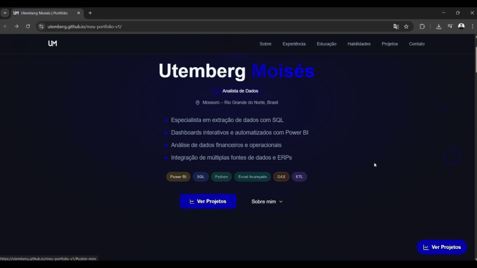
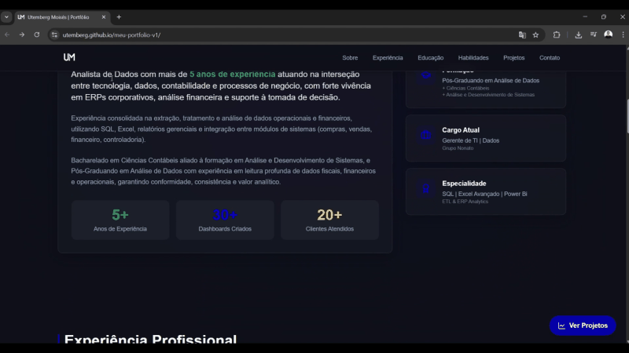

# 🧑🏻‍💻 Utemberg Moisés

**`Analista de Dados | SQL | Excel Avançado | Power BI | ERP Analytics`**

Me chamo **Utemberg Moisés**, sou **Analista de Dados** com **mais de 5 anos de experiência** atuando na interseção entre **tecnologia, dados, contabilidade e processos de negócio**. Tenho vivência com **ERPs corporativos**, **análise financeira**, extração e tratamento de dados com **SQL**, e criação de **dashboards gerenciais no Power BI** para apoiar a tomada de decisão.

📍 Mossoró – RN, Brasil  
✉️ utembergsh@gmail.com  
🔗 LinkedIn: https://www.linkedin.com/in/utembergdata  
💻 Portfólio: https://utemberg.github.io/meu-portfolio-v1/  

---

## 🔗 Conecte-se comigo

<p align="left">
  <a href="https://www.linkedin.com/in/utembergdata">
    
  </a>
  <a href="mailto:utembergsh@gmail.com">
    
  </a>
</p>

---

## ✅ Destaques (o que eu entrego)

- Extração e tratamento de dados com **SQL**
- **Dashboards interativos** e relatórios gerenciais com **Power BI**
- Análises **financeiras e operacionais** (KPIs e métricas)
- Integração e consolidação de dados entre módulos de **ERP**
- Automação e otimização de rotinas para reduzir retrabalho e aumentar confiabilidade

---

## 🧠 Projeto em destaque

### 🌐 Portfólio Profissional (GitHub Pages)
Meu principal projeto público no momento é meu **portfólio online**, onde apresento minha trajetória, competências e stack técnica.

🔗 **Acesse:**  
👉 https://utemberg.github.io/meu-portfolio-v1/

---

## 🎥 Demonstração do Portfólio

> **Como usar:** envie estes arquivos para `assets/portfolio/` no seu repositório do perfil:
> - `assets/portfolio/portfolio-demo.gif`
> - `assets/portfolio/portfolio-hero.gif`
> - `assets/portfolio/portfolio-tech.gif`

<p align="center">
  
</p>

<p align="center">
  <i>Visão geral do portfólio: navegação, layout e organização das seções.</i>
</p>

<p align="center">
  
</p>

<p align="center">
  <i>Página inicial com apresentação profissional e proposta de valor.</i>
</p>

<p align="center">
  
</p>

<p align="center">
  <i>Seção de tecnologias e habilidades com foco em dados e BI.</i>
</p>

---

## 🧰 Linguagens e Tecnologias

<p align="left">
  

  

  

  

  

  
</p>

<br/>
<br/>

> **Habilidades Técnicas:**  
> SQL • Power BI • Excel Avançado • DAX • KPIs • Integração de Dados • ERP (CISS, Fortes)

---

## 📌 Experiência Profissional

- **Gerente de TI / Dados — Grupo Nonato** (Fev/2024 – atual)  
- **Analista de Implantação — CISS S.A.** (Fev/2023 – Fev/2024)  
- **Especialista em Consultoria — Fortes Tecnologia** (Mar/2022 – Fev/2023)  
- **Assistente de TI / Dados — Grupo Nonato** (Nov/2020 – Mar/2022)  

---

## 📚 Formação

- Pós-Graduação em Análise de Dados — Descomplica (cursando)  
- Tecnólogo em Análise e Desenvolvimento de Sistemas — UNINTER (2023–2025)  
- Ciências Contábeis — Faculdade Católica do RN (2020–2023)  

---

## 📊 Estatísticas do GitHub

<p>
  
  
</p>
```
